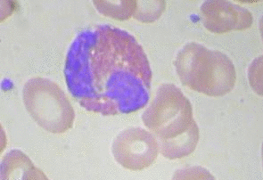
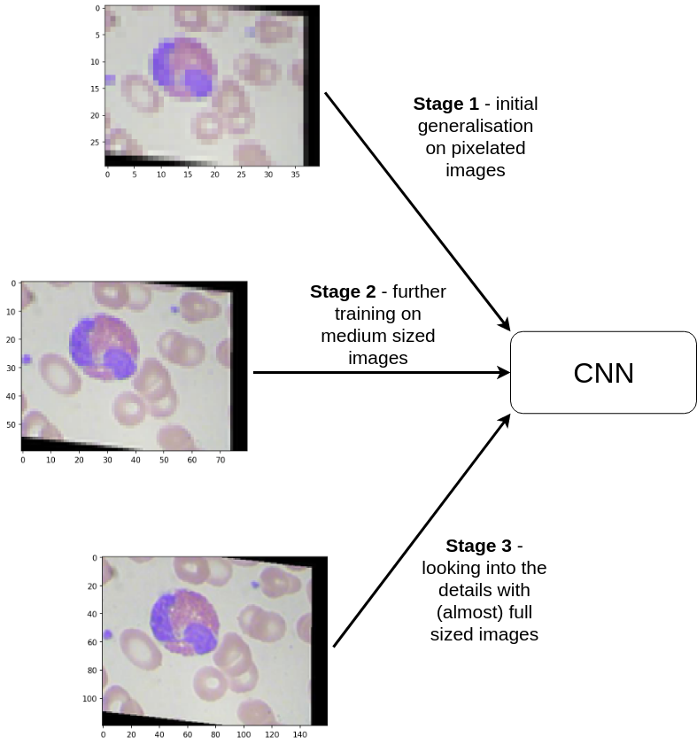
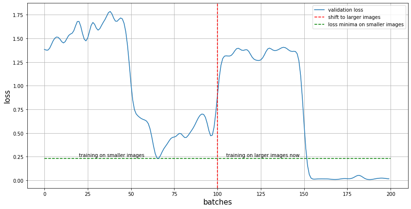
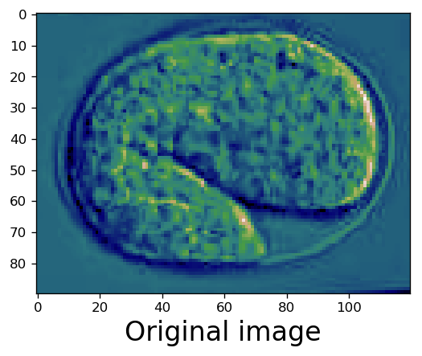
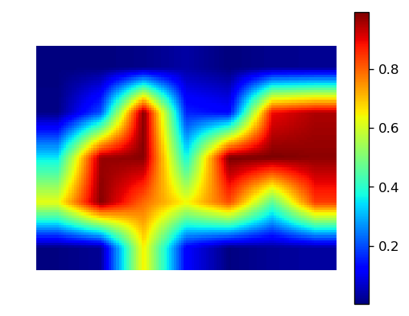
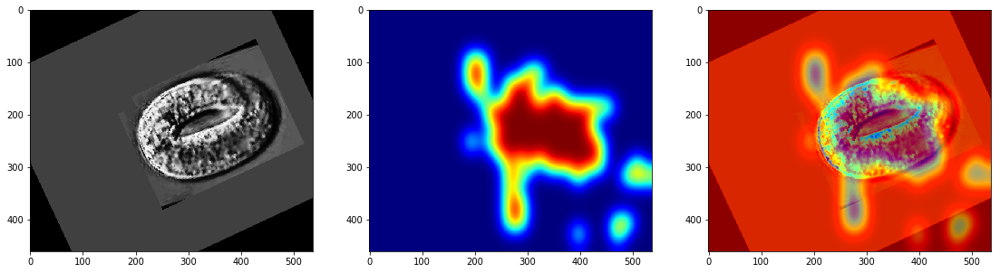
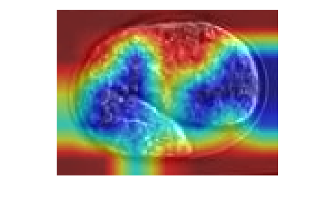

# Adventures with augmentation :mag:

Exploring and experimenting with microscope imagery datasets. :microscope:

## Simulating fluidity of cells with random distortions 

.

## 

## [Parallel CNNs are just as good as they look](https://github.com/Mayukhdeb/adventures-with-augmentation/blob/master/parallel_CNNs.ipynb)

.

### But why use them anyways ?
* Because when two different architectures are trained on the same training set, they don't have the same weaknesses (i.e different confusion matrices) 
* This means that when both are combined, they tend to neutralise each other's weaknesses, which gives us a boost in accuracy.

## [Transfer learning with image resizing](https://github.com/Mayukhdeb/adventures-with-augmentation/blob/master/c_elegans_lifecycle.ipynb)

* It aims to achieve the benefits of transfer learning on a large architecture on a smaller one
* It works by first training the model on smaller images, and then gradually increasing the size.
* Takes a lot less time than conventional training approaches, in this case it achieved 12% more accuracy (98% instead of 86%) in one fifth of the time.

## [Class activation heatmaps on deep neural networks](https://github.com/Mayukhdeb/adventures-with-augmentation/blob/master/visualise_cnn_layers.ipynb)

 .

* Shows the regions of the image which gave the most activations for a certain label in a trained classification model
* In simpler words, it tells us about the regions of the image which made the model decide that it belongs to a certain label "x"

## Determining location of cells from images 

#### And when the heatmap is superimposed upon the real image, it gives us an insight on how the CNN "looked" at the image

## What's under way :chart_with_upwards_trend:
1. Trying to find out which augmentation technique works best for the cell images 
2. Experiment with the augmentation techniques and reach a high accuracy on the test set
3. Implement transfer learning with image resizing to reach high accuracies in less that half the time it's supposed to take
4. Trying to implement parallel CNNs for better accuracies on smaller architectures
5. Plotting and comparing confusion matrices of different architectures 

