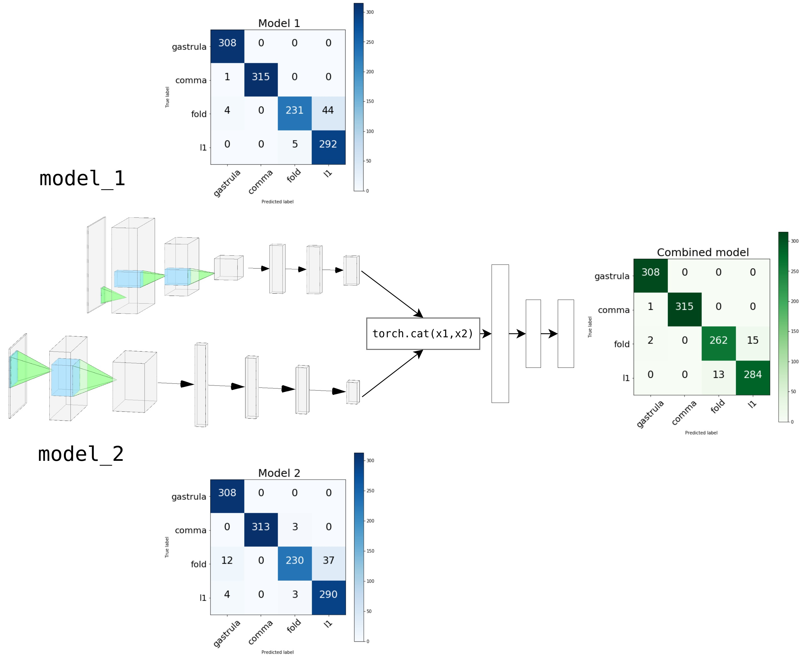

# Adventures with augmentation :mag:

Exploring and experimenting with microscope imagery datasets. :microscope:

## What's under way :chart_with_upwards_trend:
1. Trying to find out which augmentation technique works best for the cell images 
2. Experiment with the augmentation techniques and reach a high accuracy on the test set
3. Implement transfer learning with image resizing to reach high accuracies in less that half the time it's supposed to take
4. Trying to implement parallel CNNs for better accuracies on smaller architectures
5. Plotting and comparing confusion matrices of different architectures 

## Parallel CNNs work just as good as they look

.

### But why use them anyways ?
* Because when two different architectures are trained on the same training set, they don't have the same weaknesses (i.e different confusion matrices) 
* This means that when both are combined, they tend to neutralise each other's weaknesses, which gives us a boost in accuracy.

